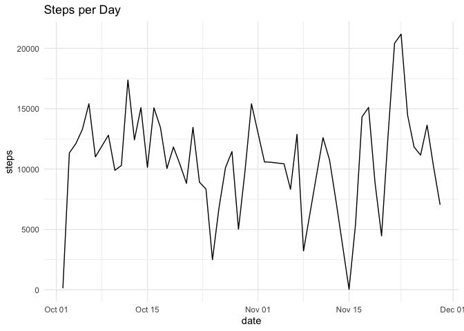
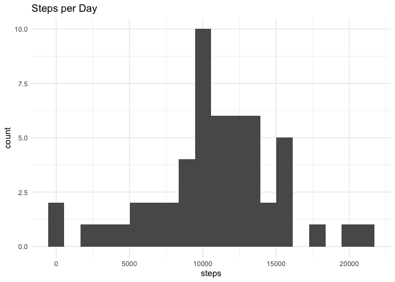
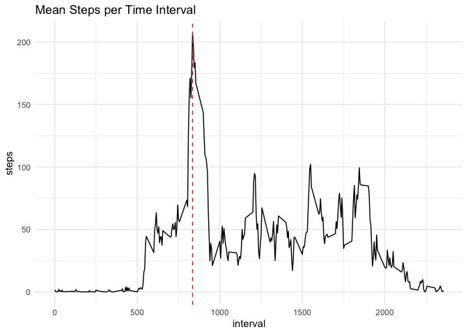
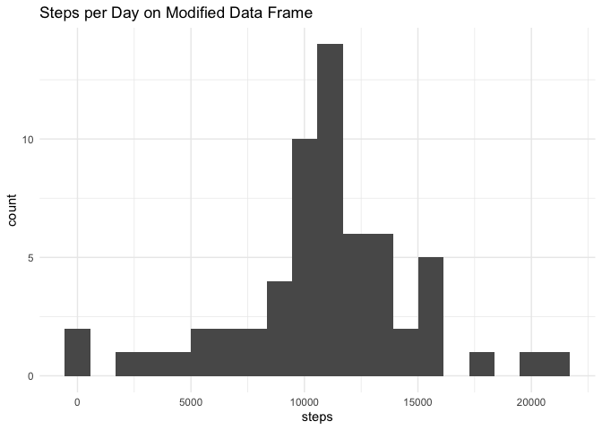
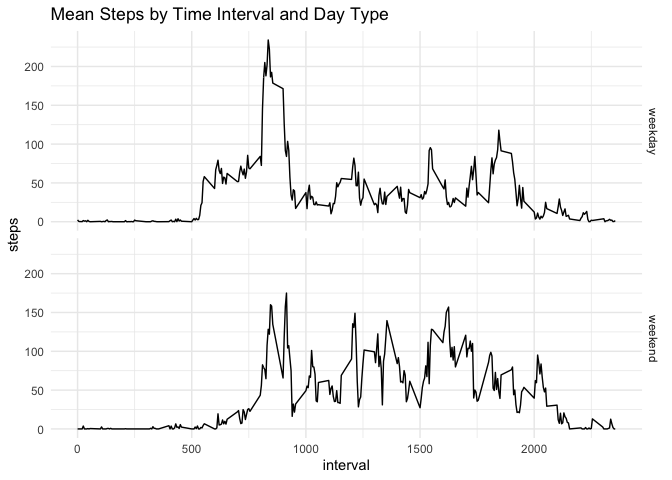

  


## Loading and preprocessing the data

#### 1) Install / load necessary libraries  


```r
# install packages if needed, otherwise load in libraries
if(!require(pacman)) install.packages('pacman')
pacman::p_load(tidyverse,DT, knitr, lattice)

# set default theme for ggplot graphs
theme_set(theme_minimal())
```

#### 2) Unzip and read data file

```r
# unzip and read activity data as data frame
df <- read.csv(unz("activity.zip", "activity.csv"), colClasses = c("integer","Date","integer"),
               stringsAsFactors = F)
```


## What is mean total number of steps taken per day?  
  
Note: summary statistics and plots below ignore all observations with `NAs`.  
  
#### 1) Calculate total number of steps per day.  
  
Below is a summary of steps per day in table form:  


```r
# calculate total steps per day; filter out missing observations
steps_per_day <- df %>% filter(!is.na(steps)) %>% 
  group_by(date) %>%
  summarise(steps = sum(steps)) 

# table of total steps per day
kable(steps_per_day)
```


|date       | steps|
|:----------|-----:|
|2012-10-02 |   126|
|2012-10-03 | 11352|
|2012-10-04 | 12116|
|2012-10-05 | 13294|
|2012-10-06 | 15420|
|2012-10-07 | 11015|
|2012-10-09 | 12811|
|2012-10-10 |  9900|
|2012-10-11 | 10304|
|2012-10-12 | 17382|
|2012-10-13 | 12426|
|2012-10-14 | 15098|
|2012-10-15 | 10139|
|2012-10-16 | 15084|
|2012-10-17 | 13452|
|2012-10-18 | 10056|
|2012-10-19 | 11829|
|2012-10-20 | 10395|
|2012-10-21 |  8821|
|2012-10-22 | 13460|
|2012-10-23 |  8918|
|2012-10-24 |  8355|
|2012-10-25 |  2492|
|2012-10-26 |  6778|
|2012-10-27 | 10119|
|2012-10-28 | 11458|
|2012-10-29 |  5018|
|2012-10-30 |  9819|
|2012-10-31 | 15414|
|2012-11-02 | 10600|
|2012-11-03 | 10571|
|2012-11-05 | 10439|
|2012-11-06 |  8334|
|2012-11-07 | 12883|
|2012-11-08 |  3219|
|2012-11-11 | 12608|
|2012-11-12 | 10765|
|2012-11-13 |  7336|
|2012-11-15 |    41|
|2012-11-16 |  5441|
|2012-11-17 | 14339|
|2012-11-18 | 15110|
|2012-11-19 |  8841|
|2012-11-20 |  4472|
|2012-11-21 | 12787|
|2012-11-22 | 20427|
|2012-11-23 | 21194|
|2012-11-24 | 14478|
|2012-11-25 | 11834|
|2012-11-26 | 11162|
|2012-11-27 | 13646|
|2012-11-28 | 10183|
|2012-11-29 |  7047|
  
Here is a line plot representation of steps per day over time:


```r
# plot steps per day
ggplot(steps_per_day, aes(date,steps)) + geom_line() + 
  labs(title = "Steps per Day")
```


  
#### 2) Create histogram of steps per day  
  

```r
# plot distribution of steps/day
ggplot(steps_per_day, aes(steps)) + geom_histogram(bins=20) + 
  labs(title = "Steps per Day")
```


  
#### 3. Calculate mean and median steps per day  
  

```r
kable(
  steps_per_day %>%
    summarise(
      meanStepsDay = mean(steps),
      medianStepsDay = median(steps)
      ),
  format.args = list(big.mark = ","),
  digits = 0,
  col.names = c("Mean Steps per Day", "Median Steps per Day")
  )
```


| Mean Steps per Day| Median Steps per Day|
|------------------:|--------------------:|
|             10,766|               10,765|
## What is the average daily activity pattern?
  
#### 1. Make a time series plot of 5-minute interval and avg. steps taken

Let's first look at the steps by interval in table form.  

```r
# calculate mean steps per time interval
steps_per_interval <- df %>%
  filter(!is.na(steps)) %>% 
  group_by(interval) %>% 
  summarise(steps = mean(steps))

# table of total steps per time interval
kable(steps_per_interval, digits=1)
```


| interval| steps|
|--------:|-----:|
|        0|   1.7|
|        5|   0.3|
|       10|   0.1|
|       15|   0.2|
|       20|   0.1|
|       25|   2.1|
|       30|   0.5|
|       35|   0.9|
|       40|   0.0|
|       45|   1.5|
|       50|   0.3|
|       55|   0.1|
|      100|   0.3|
|      105|   0.7|
|      110|   0.2|
|      115|   0.3|
|      120|   0.0|
|      125|   1.1|
|      130|   1.8|
|      135|   0.2|
|      140|   0.2|
|      145|   0.4|
|      150|   0.3|
|      155|   0.0|
|      200|   0.0|
|      205|   0.0|
|      210|   1.1|
|      215|   0.0|
|      220|   0.0|
|      225|   0.1|
|      230|   0.0|
|      235|   0.2|
|      240|   0.0|
|      245|   0.0|
|      250|   1.5|
|      255|   0.9|
|      300|   0.0|
|      305|   0.0|
|      310|   0.0|
|      315|   0.0|
|      320|   0.2|
|      325|   0.6|
|      330|   1.6|
|      335|   0.6|
|      340|   0.5|
|      345|   0.1|
|      350|   0.0|
|      355|   0.0|
|      400|   1.2|
|      405|   0.9|
|      410|   2.6|
|      415|   0.0|
|      420|   0.3|
|      425|   0.4|
|      430|   4.1|
|      435|   0.7|
|      440|   3.5|
|      445|   0.8|
|      450|   3.1|
|      455|   1.1|
|      500|   0.0|
|      505|   1.6|
|      510|   3.0|
|      515|   2.2|
|      520|   3.3|
|      525|   3.0|
|      530|   2.1|
|      535|   6.1|
|      540|  16.0|
|      545|  18.3|
|      550|  39.5|
|      555|  44.5|
|      600|  31.5|
|      605|  49.3|
|      610|  53.8|
|      615|  63.5|
|      620|  50.0|
|      625|  47.1|
|      630|  52.2|
|      635|  39.3|
|      640|  44.0|
|      645|  44.2|
|      650|  37.4|
|      655|  49.0|
|      700|  43.8|
|      705|  44.4|
|      710|  50.5|
|      715|  54.5|
|      720|  49.9|
|      725|  51.0|
|      730|  55.7|
|      735|  44.3|
|      740|  52.3|
|      745|  69.5|
|      750|  57.8|
|      755|  56.2|
|      800|  73.4|
|      805|  68.2|
|      810| 129.4|
|      815| 157.5|
|      820| 171.2|
|      825| 155.4|
|      830| 177.3|
|      835| 206.2|
|      840| 195.9|
|      845| 179.6|
|      850| 183.4|
|      855| 167.0|
|      900| 143.5|
|      905| 124.0|
|      910| 109.1|
|      915| 108.1|
|      920| 103.7|
|      925|  96.0|
|      930|  66.2|
|      935|  45.2|
|      940|  24.8|
|      945|  38.8|
|      950|  35.0|
|      955|  21.1|
|     1000|  40.6|
|     1005|  27.0|
|     1010|  42.4|
|     1015|  52.7|
|     1020|  38.9|
|     1025|  50.8|
|     1030|  44.3|
|     1035|  37.4|
|     1040|  34.7|
|     1045|  28.3|
|     1050|  25.1|
|     1055|  31.9|
|     1100|  31.4|
|     1105|  29.7|
|     1110|  21.3|
|     1115|  25.5|
|     1120|  28.4|
|     1125|  26.5|
|     1130|  33.4|
|     1135|  50.0|
|     1140|  42.0|
|     1145|  44.6|
|     1150|  46.0|
|     1155|  59.2|
|     1200|  63.9|
|     1205|  87.7|
|     1210|  94.8|
|     1215|  92.8|
|     1220|  63.4|
|     1225|  50.2|
|     1230|  54.5|
|     1235|  32.4|
|     1240|  26.5|
|     1245|  37.7|
|     1250|  45.1|
|     1255|  67.3|
|     1300|  42.3|
|     1305|  39.9|
|     1310|  43.3|
|     1315|  41.0|
|     1320|  46.2|
|     1325|  56.4|
|     1330|  42.8|
|     1335|  25.1|
|     1340|  40.0|
|     1345|  53.5|
|     1350|  47.3|
|     1355|  60.8|
|     1400|  55.8|
|     1405|  52.0|
|     1410|  43.6|
|     1415|  48.7|
|     1420|  35.5|
|     1425|  37.5|
|     1430|  41.8|
|     1435|  27.5|
|     1440|  17.1|
|     1445|  26.1|
|     1450|  43.6|
|     1455|  43.8|
|     1500|  30.0|
|     1505|  36.1|
|     1510|  35.5|
|     1515|  38.8|
|     1520|  46.0|
|     1525|  47.8|
|     1530|  48.1|
|     1535|  65.3|
|     1540|  82.9|
|     1545|  98.7|
|     1550| 102.1|
|     1555|  84.0|
|     1600|  62.1|
|     1605|  64.1|
|     1610|  74.5|
|     1615|  63.2|
|     1620|  56.9|
|     1625|  59.8|
|     1630|  43.9|
|     1635|  38.6|
|     1640|  44.7|
|     1645|  45.5|
|     1650|  46.2|
|     1655|  43.7|
|     1700|  46.6|
|     1705|  56.3|
|     1710|  50.7|
|     1715|  61.2|
|     1720|  72.7|
|     1725|  78.9|
|     1730|  68.9|
|     1735|  59.7|
|     1740|  75.1|
|     1745|  56.5|
|     1750|  34.8|
|     1755|  37.5|
|     1800|  40.7|
|     1805|  58.0|
|     1810|  74.7|
|     1815|  85.3|
|     1820|  59.3|
|     1825|  67.8|
|     1830|  77.7|
|     1835|  74.2|
|     1840|  85.3|
|     1845|  99.5|
|     1850|  86.6|
|     1855|  85.6|
|     1900|  84.9|
|     1905|  77.8|
|     1910|  58.0|
|     1915|  53.4|
|     1920|  36.3|
|     1925|  20.7|
|     1930|  27.4|
|     1935|  40.0|
|     1940|  30.2|
|     1945|  25.5|
|     1950|  45.7|
|     1955|  33.5|
|     2000|  19.6|
|     2005|  19.0|
|     2010|  19.3|
|     2015|  33.3|
|     2020|  26.8|
|     2025|  21.2|
|     2030|  27.3|
|     2035|  21.3|
|     2040|  19.5|
|     2045|  21.3|
|     2050|  32.3|
|     2055|  20.2|
|     2100|  15.9|
|     2105|  17.2|
|     2110|  23.5|
|     2115|  19.2|
|     2120|  12.5|
|     2125|   8.0|
|     2130|  14.7|
|     2135|  16.3|
|     2140|   8.7|
|     2145|   7.8|
|     2150|   8.1|
|     2155|   2.6|
|     2200|   1.5|
|     2205|   3.7|
|     2210|   4.8|
|     2215|   8.5|
|     2220|   7.1|
|     2225|   8.7|
|     2230|   9.8|
|     2235|   2.2|
|     2240|   0.3|
|     2245|   0.1|
|     2250|   1.6|
|     2255|   4.6|
|     2300|   3.3|
|     2305|   2.8|
|     2310|   0.0|
|     2315|   0.8|
|     2320|   1.0|
|     2325|   1.6|
|     2330|   2.6|
|     2335|   4.7|
|     2340|   3.3|
|     2345|   0.6|
|     2350|   0.2|
|     2355|   1.1|

Below is a line plot of steps per interval


```r
# find interval with maximum steps
max_int <- steps_per_interval$interval[steps_per_interval$steps == max(steps_per_interval$steps)]

# line plot of average steps per time interval
ggplot(steps_per_interval, aes(interval,steps)) + geom_line() + 
  labs(title="Mean Steps per Time Interval") +
  geom_vline(xintercept=max_int,color='red', linetype = "dashed") 
```

<!-- -->

#### 2. Display interval with maximum steps  

```r
paste("Time interval with maximum average steps: ", max_int)
```

```
[1] "Time interval with maximum average steps:  835"
```


## Imputing missing values

#### 1. Calculate total number of rows with NAs  
  

```r
miss_rows <- sum(is.na(df$steps))
paste("Number of missing rows:",miss_rows)
```

```
[1] "Number of missing rows: 2304"
```
  
#### 2. Develop method for encoding missing values  
  
Let's use impute missing values by using the mean step value for the given time interval.  The mean values are already available in the data frame, `steps_per_interval`. Below are the first five records from this summary-level dataset.  


```r
# print first few records of steps_per_interval
kable(head(steps_per_interval), digits=1)
```


| interval| steps|
|--------:|-----:|
|        0|   1.7|
|        5|   0.3|
|       10|   0.1|
|       15|   0.2|
|       20|   0.1|
|       25|   2.1|
  
#### 3. Create new dataset with imputed values where missing  
  
Below we create a new data frame using mean steps per interval to impute missing values.  
  

```r
# create modified data frame with imputed missing step values
df_mod <- df %>%
  left_join(steps_per_interval, by="interval", suffix=c("","_imputed")) %>% 
  mutate(steps = ifelse(is.na(steps),steps_imputed,steps)) %>% 
  select(steps, date,interval)
```
#### 4. Create histogram and calculate mean and median steps using modified data frame


```r
# calculate total steps per day on modified df
steps_per_day_mod <- df_mod %>% 
  group_by(date) %>%
  summarise(steps = sum(steps)) 

# create histogram  of steps/day
ggplot(steps_per_day_mod, aes(steps)) + geom_histogram(bins=20) + 
  labs(title = "Steps per Day on Modified Data Frame")
```



```r
# mean and median steps per data on imputed, modified data frame
kable(
  steps_per_day_mod %>%
    summarise(
      meanStepsDay = mean(steps),
      medianStepsDay = median(steps)
      ),
  format.args = list(big.mark = ","),
  digits = 0,
  col.names = c("Mean Steps per Day", "Median Steps per Day")
  )
```


| Mean Steps per Day| Median Steps per Day|
|------------------:|--------------------:|
|             10,766|               10,766|

  

```r
# compare mean of modified df against original with missing values
diff_mean <- mean(steps_per_day_mod$steps) - mean(steps_per_day$steps)
paste0("The mean steps per day using imputed values changed by ",diff_mean, " compared to the original data.")
```

```
[1] "The mean steps per day using imputed values changed by 0 compared to the original data."
```

```r
# compare median of modified df against original with missing values
diff_median <- median(steps_per_day_mod$steps) - median(steps_per_day$steps)
paste0("The median steps per day using imputed values changed by ",round(diff_median,2), " compared to the original data.")
```

```
[1] "The median steps per day using imputed values changed by 1.19 compared to the original data."
```

## Are there differences in activity patterns between weekdays and weekends?  
  
#### 1. Create a new factor variable to determine if date is weekday or weekend.  

```r
df <- df %>% 
  mutate(day_type = factor(ifelse(weekdays(date) %in% c("Saturday","Sunday"), "weekend","weekday")))
```

#### 2. Make a panel plot average steps per interval by weekend/weekday


```r
# data frame to use for panel plot
steps_day_type <- df %>% filter(!is.na(steps)) %>% 
  group_by(day_type,interval) %>% 
  summarise(steps=mean(steps))

# panel plot
ggplot(steps_day_type, aes(interval,steps)) + geom_line() +
  facet_grid(day_type ~.) + labs(title = "Mean Steps by Time Interval and Day Type")
```


  
The weekday line plot indicates prominent step activity in the morning (i.e. before 10am).  On the other hand, the weekend plot reveals consistently higher activity in the late morning through early evening.  


